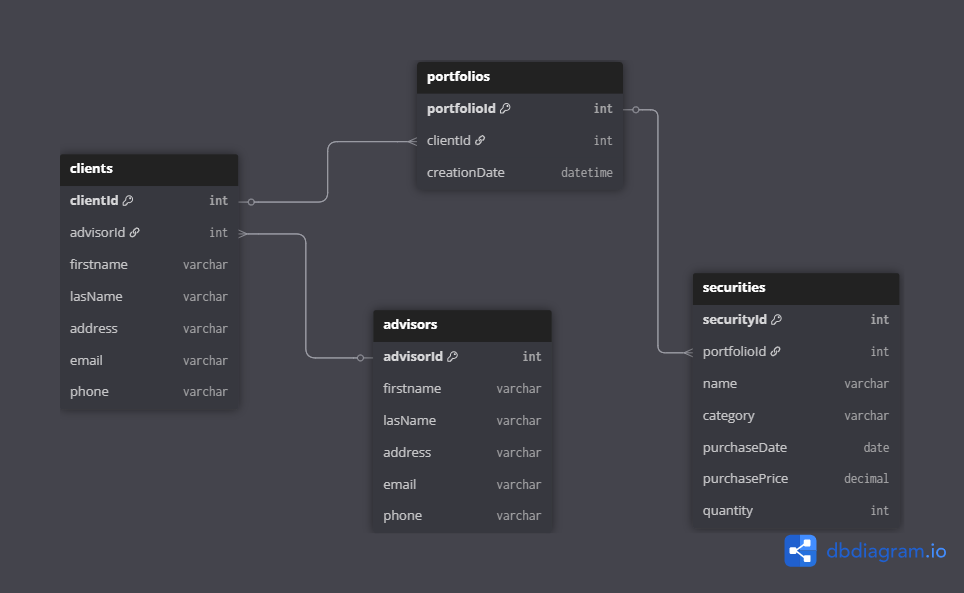

# 🧩 Task 1: Data Modeling – Portfolio Management System

## 🔍 Summary
This task involved designing an ERD for a portfolio management system used by financial advisors to manage their clients and their investments.

## ✅ Key Requirements Mapped
- One financial advisor ➝ many clients
- One client ➝ one portfolio
- One portfolio ➝ many securities
- Securities track purchase info (price, date, quantity)

## 🧱 ERD

## 💡 Key Considerations
- Used relational structure for integrity and performance
- Scalable design to handle multiple advisors/clients/securities
- Designed for use with Spring Boot backend and React dashboard

## 🛠 Tools Used
- ERD Tool: dbdiagram.io
- Backend Tech: Java + Spring

---

## 🧠 What I Learned

- Importance of planning a solid data model before development
- How to identify entities and relationships based on requirements
- Basics of relational database schema design using ERDs
